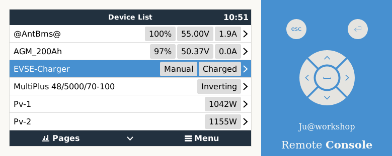
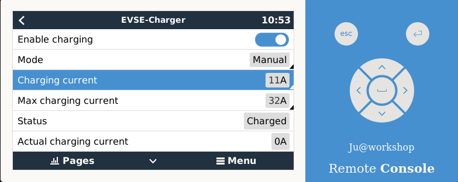
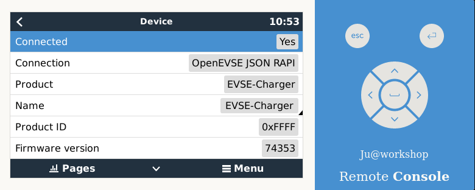
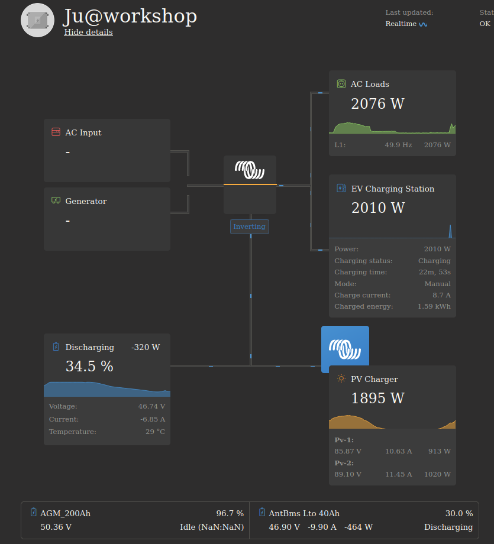
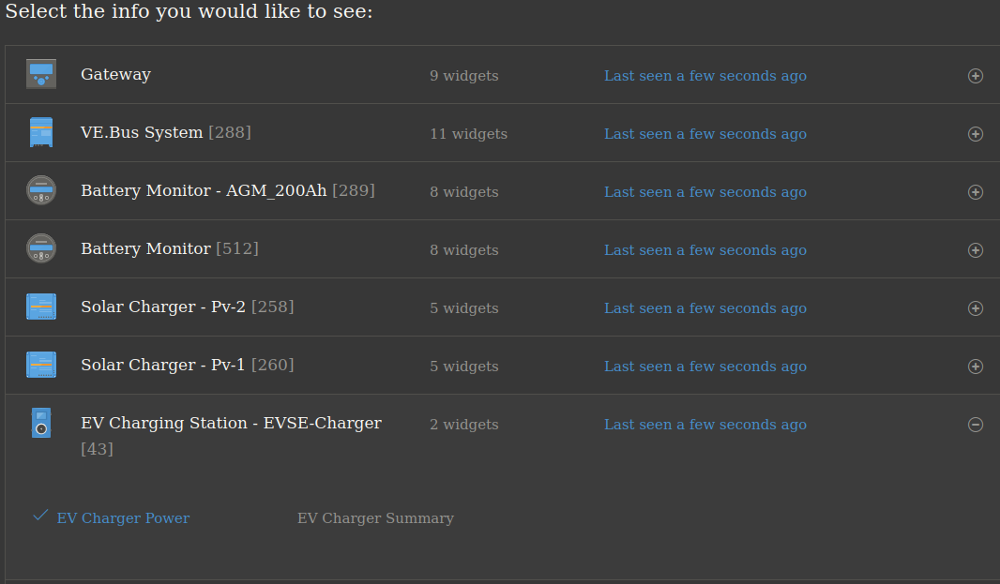
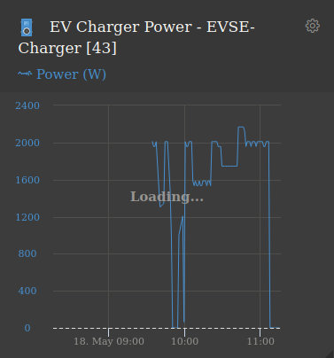

# dbus-open-evse
Integrate Open_EVSE charger into Victron Energies Venus OS

## Purpose
This script supports reading EV charger values from openEVSE base charger. Writing values is supported for "Enable charging"and  "Charging current" 

### Pictures
 

## Usefull links
Many thanks. @vikt0rm, @fabian-lauer and @trixing project:
- https://github.com/trixing/venus.dbus-twc3
- https://github.com/fabian-lauer/dbus-shelly-3em-smartmeter
- https://github.com/vikt0rm/dbus-goecharger
